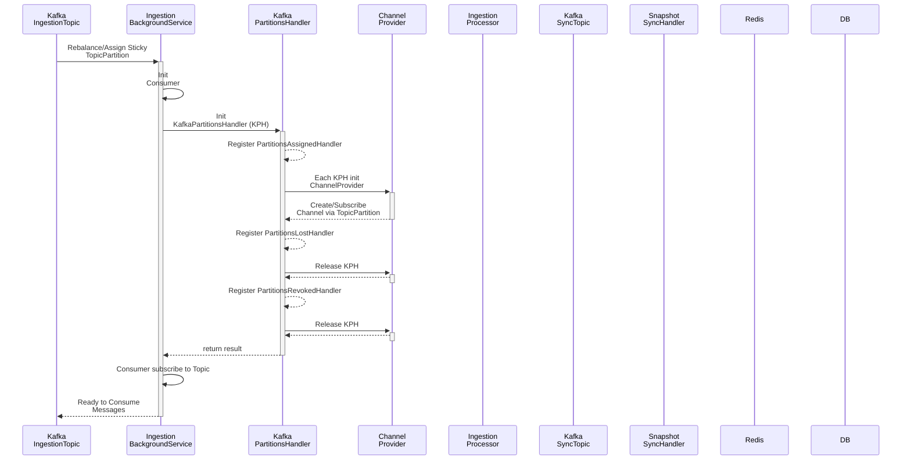

```mermaid
sequenceDiagram
    participant k as Kafka<br>IngestionTopic
    participant ibs as Ingestion <br/> BackgroundService
    participant kph as Kafka<br>PartitionsHandler
    participant cp as Channel<br>Provider
    participant ip as Ingestion<br/>Processor
    participant ks as Kafka<br>SyncTopic
    participant sh as Snapshot<br>SyncHandler
    participant r as Redis
    participant d as DB

    k ->>+ ibs: Rebalance/Assign Sticky <br> TopicPartition
    ibs ->>ibs: Init <br> Consumer
    ibs ->>+kph: Init <br> KafkaPartitionsHandler (KPH)
    kph -->>kph: Register PartitionsAssignedHandler
    kph ->>+cp: Each KPH init <br> ChannelProvider
    cp -->>-kph: Create/Subscribe <br> Channel via TopicPartition
    kph -->>kph: Register PartitionsLostHandler
    kph ->>+cp: Release KPH
    cp -->>-kph: 
    kph -->>kph: Register PartitionsRevokedHandler
    kph ->>+cp: Release KPH
    cp -->>-kph: 
    kph -->>-ibs: return result 
    ibs ->>ibs: Consumer subscribe to Topic
    ibs -->>-k: Ready to Consume <br>Messages

```