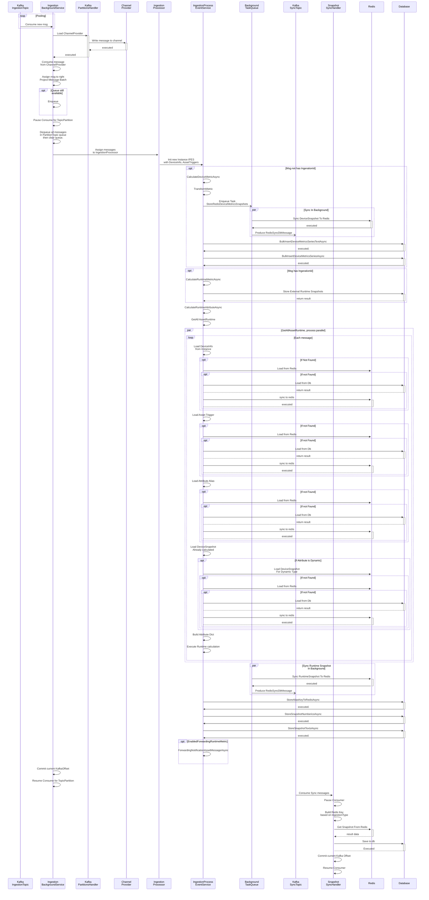

```mermaid
sequenceDiagram
    
    participant k as Kafka<br>IngestionTopic
    participant ibs as Ingestion <br/> BackgroundService
    participant kph as Kafka<br>PartitionsHandler
    participant cp as Channel<br>Provider
    participant ip as Ingestion<br/>Processor
    participant ipes as IngestionProcess<br/>EventService
    participant bg as Background<br/>TaskQueue
    participant ks as Kafka<br>SyncTopic
    participant sh as Snapshot<br>SyncHandler
    participant r as Redis
    participant db as Database

    loop Pooling
    k->>ibs: Consume new msg
    end
    ibs->>+kph: Load ChannelProvider
    kph->>+cp: Write message to channel
    cp-->>-kph: executed
    kph-->>-ibs: executed
    ibs->>ibs: Consume message<br/> from ChannelProvider
    ibs->>ibs: Assign msg to right <br/> Project Message Batch
    opt Queue still available
        ibs->>ibs: Enqueue
    end
    ibs->>ibs: Pause Consume for TopicPartition
    ibs->>ibs: Dequeue all messages <br/> in PartitionTopic queue <br/> then clear queue.
    ibs->>+ip: Assign messages <br/> to IngestionProcessor
    ip->>ipes: Init new Instance IPES <br/> with DeviceInfo, AssetTriggers
    opt Msg not has IngerationId
    ipes->>ipes: CalculateDeviceMetricAsync
    ipes->>ipes: TransformMetric
    ipes-)bg: Enqueue Task <br/> StoreRedisDeviceMetricsSnapshots
    par Sync In Background
    bg->>+r: Sync DeviceSnapshot To Redis
    r->>-bg: executed
    bg-)ks: Produce RedisSyncDbMessage
    end
    ipes->>+db: BulkInsertDeviceMetricsSeriesTextAsync
    db->>-ipes: executed.
    ipes->>+db: BulkInsertDeviceMetricsSeriesAsync
    db->>-ipes: executed.
    end
    opt Msg has IngerationId
    ipes->>ipes: CalculateRuntimeMetricAsync
    ipes->>+db: Store External Runtime Snapshots
    db-->>-ipes: return result
    end
    ipes->>ipes: CalculateRuntimeAttributeAsync
    ipes->>ipes: GetAll AssetRuntime
    par GetAllAssetRuntime, process parallel
        loop Each message
            ipes ->>ipes: Load DeviceInfo <br/> from Instance
            opt If Not Found
                ipes->>+r: Load from Redis
                opt If not Found
                    ipes->>+db: Load from Db
                    db-->-ipes: return result
                    ipes->>+r: sync to redis
                    r-->-ipes: executed
                end
            end
            ipes->>ipes: Load Asset Trigger
            opt If not Found
                ipes->>r: Load from Redis
                opt If not Found
                    ipes->>+db: Load from Db
                    db-->-ipes: return result
                    ipes->>+r: sync to redis
                    r-->-ipes: executed
                end
            end
            ipes->>ipes: Load Attribute Alias
            opt If not Found
                ipes->>r: Load from Redis
                opt If not Found
                    ipes->>+db: Load from Db
                    db-->-ipes: return result
                    ipes->>+r: sync to redis
                    r-->-ipes: executed
                end
            end
            ipes->>ipes: Load DeviceSnapshot <br/> Already calculated
            opt If Attribute is Dynamic
                ipes->>r: Load DeviceSnapshot <br> For Dynamic Type
                opt If not Found
                    ipes->>r: Load from Redis
                    opt If not Found
                        ipes->>+db: Load from Db
                        db-->-ipes: return result
                        ipes->>+r: sync to redis
                        r-->-ipes: executed
                    end
                end
            end
            ipes->>ipes: Build Attribute Dict
            ipes->>ipes: Execute Runtime calculation
        end
    end
    par Sync Runtime Snapshot <br/>In Background
    bg->>+r: Sync RuntimeSnapshot To Redis
    r->>-bg: executed
    bg-)ks: Produce RedisSyncDbMessage
    end
    ipes->>+db: StoreAliasKeyToRedisAsync
    db->>-ipes: executed.
    ipes->>+db: StoreSnapshotNumbericsAsync
    db->>-ipes: executed.
    ipes->>+db: StoreSnapshotTextsAsync
    db->>-ipes: executed.
    opt EnabledForwardingRuntimeMetric
    ipes->>ipes:ForwardingNotificationAssetMessageAsync
    end
    ibs->>ibs: Commit current KafkaOffset
    ibs->>ibs: Resume Consume for TopicPartition
    
    ks->>+sh: Consume Sync messages
    sh->>sh: Pause Consumer
    sh->>sh: Build Redis Key <br/> based on IngestionType
    sh->>+r: Get Snapshot From Redis
    r-->>-sh: result data
    sh->>+db: Save to db
    db-->-sh: Executed
    sh->>sh: Commit current Kafka Offset
    sh->>sh: Resume Consumer


    


```